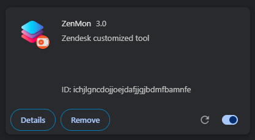
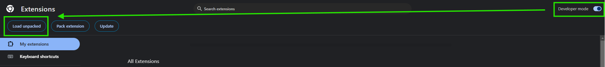

# ZenMon

ZenMon is a Zendesk extension that can be installed in your browser. This will inject Javascript code to Zendesk with additional functionality like notification and alarms.

## Installation

To install the Extension on your browser, make sure to enable the `Developer mode`. This will allow you to install external or uncompiled extension.

Once you enabled the Developer Mode, press the `Load Unpacked` button and navigate to the ZenMon directory. This will load the project.

In your Zendesk website, refresh for the script to take effect.

## Quick Start for Contributors

To get started, here’s what you need to know:

### Code of Conduct

We prioritize creating a respectful and inclusive environment. Please review and adhere to our Code of Conduct to ensure a positive experience for all collaborators.

### Reporting Bugs

If you find a bug in the codebase:

1. **Check Existing Issues:** Verify if the issue has already been reported to avoid duplication.
2. **Create a Detailed Issue:** Include a descriptive title, a clear explanation of the problem, steps to reproduce, and the expected outcome.

### Feature Requests

To suggest a new feature:

1. **Search Existing Suggestions:** Check if someone else has already proposed something similar.
2. **Submit a New Issue:** Clearly describe the proposed feature, its benefits, and possible implementations.

## How to Contribute Code

### Setting Up Your Development Environment

1. **Fork the Repository:** Start by forking the Zentinel.JS repository on GitHub.
2. **Clone Your Fork:** Clone your forked repository to your local machine.
3. **Install Dependencies:** Navigate to the project directory and run `npm install` to install required dependencies.

### Making Changes

1. **Create a New Branch:** Use a branch specific to the feature or fix you are working on.
2. **Commit Changes:** Make your changes in the new branch. Commit messages should clearly explain the purpose of the changes.
3. **Write Tests:** Add or update tests to cover the new functionality or fixes. Ensure all tests pass.

### Pull Request Process

1. **Update Your Branch:** Rebase your branch on the latest main branch to ensure a smooth integration.
2. **Submit a Pull Request (PR):** Push your branch to GitHub and open a PR against the main branch of the original Zentinel.JS repository.
3. **Review Process:** The project maintainer will review your PR. Be open to making revisions based on feedback.
4. **PR Approval and Merge:** Once approved, the maintainers will merge your PR.

## Additional Resources

- **Documentation:** Familiarize yourself with the project documentation to understand how to use and extend Zentinel.JS.
- ~~**Community:** Join our community forums or chat channels to discuss ideas and ask questions.~~

## Acknowledgments

Contributors who help improve Zentinel.JS make a significant impact. We appreciate your dedication and effort in enhancing this project.

Thank you for choosing to contribute to Zentinel.JS. We look forward to your contributions!

